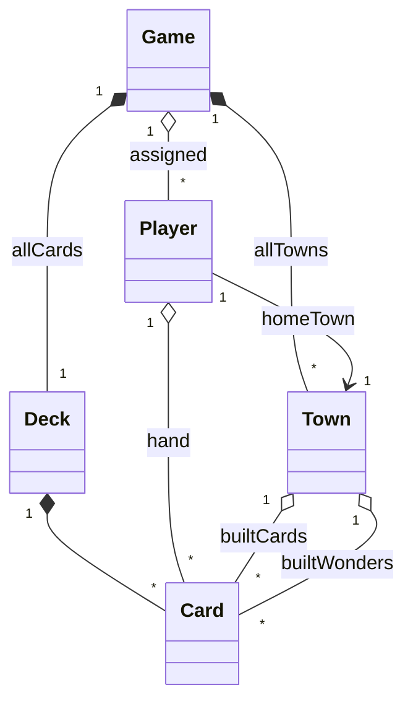
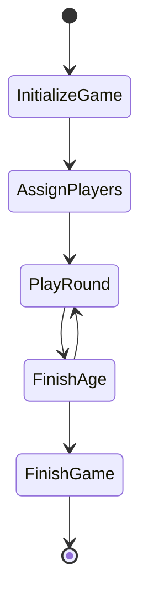

# Project architecture

## Game classes structure

```mermaid
classDiagram
    class Game
    class Player
    class Town
    class Deck
    class Card

    Game "1" o-- "*" Player : assigned
    Game "1" *-- "1" Deck : allCards
    Deck "1" *-- "*" Card
    Game "1" *-- "*" Town : allTowns
    Player "1" --> "1" Town : homeTown
    Player "1" o-- "*" Card : hand
    Town "1" o-- "*" Card : builtCards
    Town "1" o-- "*" Card : builtWonders
```

## Game state diagram

```mermaid
stateDiagram-v2
    [*] --> InitializeGame
    InitializeGame --> AssignPlayers
    AssignPlayers --> PlayRound
    PlayRound --> FinishAge
    FinishAge --> PlayRound
    FinishAge --> FinishGame
    FinishGame --> [*]
```
