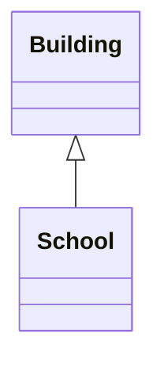
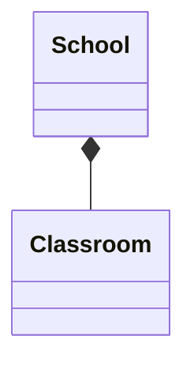
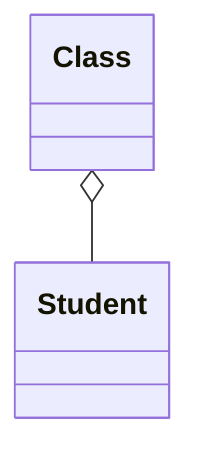
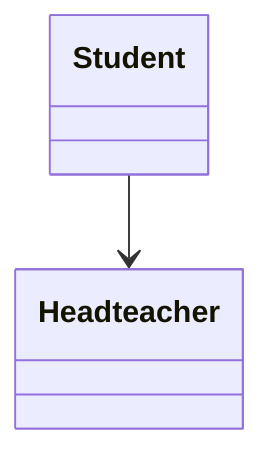
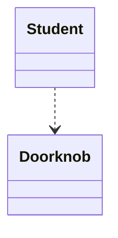
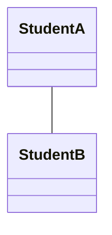
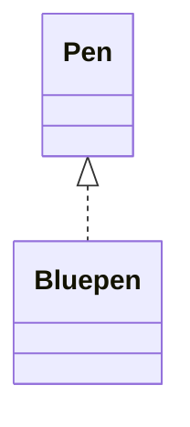

# OOP description
Specyfication and description of project's oop (Object oriented programming).

## UML
UML - Unified Modeling Language

### Relations
| UML name    | Mermaid     | Relation       | Description                                    |
|-------------|-------------|----------------|------------------------------------------------|
| Inheritance | `A <\|-- B` | B is an A      | A is a parent of B                             |
| Composition | `A *-- B`   | A owns B       | B doesn't exist without A                      |
| Aggregation | `A o-- B`   | A uses B       | B is a part of A but B can exist without A     |
| Association | `A --> B`   | A knows B      | A and B have relation but exist independently  |
| Dependency  | `A ..> B`   | A meets B      | A and B doesn't have stable relation           |
| Relation    | `A -- B`    | any            | relation absent in UML but possible in Mermaid |
| Interface   | `A <\|.. B` | B looks like A | B has same methods like A                      |

### Examples
- Inheritance

- Composition

- Aggregation

- Association

- Dependency

- Relation

- Interface

